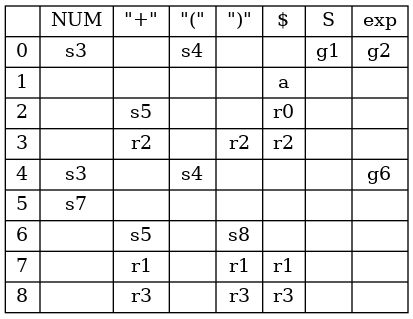

A library/tool for generating parsers and inspecting `LR` parsing tables.  
Supports `LR(0)`, `SLR`, `LR(1)` or `LALR(1)`, whichever you prefer.

## Usage

Use the `CLI` or include [inc/pgen/pgen.h](inc/pgen/pgen.h) and [src/pgen.c](src/pgen.c) into your project.  
Do check out [this example](./tests/exp.c) of how to define a simple grammar in `C` and dump all generated tables and sets.

## CLI

The command line expects you to provide a file defining your grammar. The synax isn't [yacc](https://en.wikipedia.org/wiki/Yacc) compatible, but should be intuitive, sorry!

[Here's](./tests/exp.g) an example of a simple grammar file:
```
# single-line comments

# if start sym not specified - lhs of the first rule is used
%start S

# declare all your terminals
# undeclared symbols are assumed to be non-terminals
%term NUM
%term PLUS

# terminals can have string aliases (you still have to tokenize them yourself)
%term MINUS "-"
%term LPAREN "("
%term RPAREN ")"

S -> exp;

exp -> exp PLUS NUM
     | exp "-" NUM
     | NUM;

exp -> "(" exp ")";
```
If you want to generate a parser and not just inspect your grammar - you'll have to define a few more things.  
Check out [this](./tests/expp.g) example for a comprehensive grammar file.
```
Usage: pgen [flags] file.g
    -h          print this message and exit
    -t type     type of parsing table to generate [lr0, slr, lr1, lalr1], default: lalr1
    -s          print symbols
    -r          print rules
    -n          print nullable set
    -fr         print first sets
    -fl         print follow sets
    -ds file    print state transitions to file in DOT
    -dt file    print parsing table to file in DOT
    -g file     generate a parser in C and write to file
```

## DOT

For better readability, state transitions can be dumped in [DOT](https://en.wikipedia.org/wiki/DOT_(graph_description_language)).  
In `grammar.g`:
```
%term NUM
S -> exp;
exp -> exp "+" NUM;
exp -> NUM;
exp -> "(" exp ")";
```
```
pgen -t slr -ds states.dot -dt table.dot grammar.g
```
```
dot states.dot -T png -o states.png
dot table.dot -T png -o table.png
```
`SLR` states  


`SLR` parsing table  


## Notes

Some notes to remind myself of the differences between `LR(0)`, `SLR`, `LR(1)` and `LALR(1)` grammars.

Suppose your parser has a state with the following items.

```
S -> exp .
S -> exp . "+" NUM
```

An `LR(0)` parser will attempt to reduce whenever possible on every lookahead, even on `"+"` in this case. This item will cause a `shift/reduce` error as it attempts to reduce by rule `S -> exp` and shift on `"+"`.

An `SLR` parser would reduce by `S -> exp` only if the lookahead was in `follow(S)`. In this case, if `"+"` was in `follow(S)` it would cause a `shift/reduce` error in an `SLR` parser.

An `LR(1)` parser modifies the notion of an item by pairing each one with a lookahead.

An item such as `{S -> a . b | $}` implies that the remaining input can be derived from `b $`.

Method for calculating `closures` in `LR(1)`.

```
closure(I) {
    for each item {S -> a . B c | x} in I
        for each production B -> b
            for each symbol in first(cx)
                add {B -> . b | symbol} to I
    until I doesn't change
    return I
}
```

Reductions are inserted in the parsing table for the lookaheads found in these items.

An `LALR(1)` parser is an `LR(1)` parser where equivalent states are merged. **Lookaheads are ignored when comparing states.**
